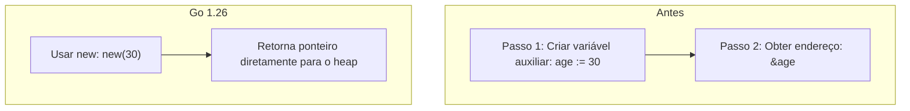
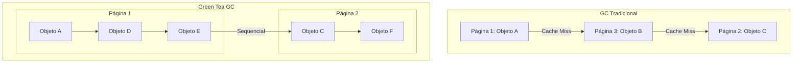

E aí, pessoal!

Go 1.26 foi lançado em fevereiro de 2026, seis meses após a versão 1.25. O lançamento traz atualizações na especificação da linguagem, no comportamento do runtime e nas ferramentas de desenvolvimento.

A principal novidade é a ativação por padrão do Green Tea garbage collector, que foca na melhora da localidade de memória. Abaixo estão detalhadas as principais mudanças de cada componente.

---

## O que você vai encontrar aqui

Esta versão traz mudanças em quatro áreas principais:

1. **Mudanças na linguagem**: `new` com suporte a expressões e auto-referência em parâmetros de tipos genéricos.
2. **Novo garbage collector**: Green Tea GC ativado por padrão.
3. **Ferramentas**: reestruturação do comando `go fix` com foco em modernizadores.
4. **Biblioteca padrão**: otimizações em `io`, novos iteradores em `reflect` e novos pacotes de criptografia.

---

## 1. Mudanças na linguagem

### A função `new` aceita expressões como operando

A função built-in `new` agora permite que o argumento seja uma expressão, definindo o valor inicial do ponteiro alocado.

Essa alteração reduz a necessidade de código auxiliar apenas para referenciar ponteiros em estruturas que utilizam campos opcionais, como JSON ou Protocol Buffers:

```go
type Person struct {
    Name string `json:"name"`
    Age  *int   `json:"age"` // nil caso o campo seja omitido
}

func personJSON(name string, born time.Time) ([]byte, error) {
    return json.Marshal(Person{
        Name: name,
        Age:  new(yearsSince(born)), // Alocação e inicialização direta
    })
}
```

Anteriormente, o compilador exigia a declaração de uma variável temporária para obter o endereço de memória:

```go
// Abordagem anterior ao Go 1.26
age := yearsSince(born)
person := Person{Name: name, Age: &age}
```



### Generics: auto-referência na lista de parâmetros de tipo

Foi removida a restrição que impedia um tipo genérico de se referenciar em sua própria lista de parâmetros de tipo. Agora é possível definir restrições (*constraints*) que referenciam o próprio tipo que está sendo parametrizado:

```go
type Adder[A Adder[A]] interface {
    Add(A) A
}

func algo[A Adder[A]](x, y A) A {
    return x.Add(y)
}
```

Antes dessa versão, a definição do tipo `Adder` na primeira linha resultava em erro de compilação por auto-referência direta. A mudança simplifica a especificação de tipos genéricos e permite restrições mais expressivas.

---

## 2. Novo garbage collector: Green Tea GC

### Arquitetura do Green Tea GC

O Green Tea garbage collector, anteriormente disponível sob flag experimental no Go 1.25, passa a ser o coletor padrão.

Ao contrário do algoritmo tradicional, que realiza a varredura baseando-se em ponteiros individuais distribuídos pela memória (o que pode degradar a localidade do cache), o Green Tea GC adota uma estratégia focada em blocos e páginas de memória contíguas. 



Essa abordagem melhora a localidade espacial e reduz a latência de marcação e varredura de objetos pequenos.

### Impacto na performance do GC

A redução estimada do overhead de GC varia de 10% a 40% em cenários com alta alocação de pequenos objetos. 

Em CPUs modernas que suportam vetorização (como arquiteturas Intel Ice Lake, AMD Zen 4 ou superiores), o runtime faz uso de instruções vetoriais para otimizar o escaneamento de objetos, proporcionando um ganho adicional de aproximadamente 10%.

### Como desativar temporariamente

Caso ocorram regressões de comportamento ou desempenho, o coletor antigo pode ser reativado definindo a flag `GOEXPERIMENT` durante a compilação:

```bash
GOEXPERIMENT=nogreenteagc go build .
```

> **Aviso de Compatibilidade**: A flag `nogreenteagc` será removida no Go 1.27. Eventuais problemas detectados com o novo coletor devem ser reportados diretamente no rastreador de issues oficial do Go.

### Otimizações no Runtime

* **Chamadas CGO**: O overhead base de invocação de funções C via cgo foi reduzido em aproximadamente 30%.
* **Randomização do Heap**: Em sistemas 64-bit, o endereço base do heap passa a ser randomizado durante a inicialização para aumentar a segurança contra ataques que exploram previsibilidade de ponteiros.
* **Goroutine Leak Profile (Experimental)**: Novo perfil de diagnóstico que detecta goroutines bloqueadas permanentemente em canais, mutexes ou variáveis de condição. A execução é realizada sob a flag:

```bash
GOEXPERIMENT=goroutineleakprofile go build .
```

---

## 3. Ferramentas: Reestruturação do `go fix`

O utilitário `go fix` foi reformulado e agora centraliza a execução de **modernizadores**. Trata-se de analisadores estáticos que automatizam a transição de bases de código legadas para padrões sintáticos modernos e novas APIs da biblioteca padrão.

A reescrita utiliza o mesmo motor de análise do `go vet`, permitindo que diagnósticos reportados pelas ferramentas de linter sejam aplicados de forma automatizada.

```bash
# Aplica as regras de modernização no projeto
go fix ./...
```

Os modernizadores aplicam refatorações que preservam a semântica original do programa. A ferramenta também inclui um mecanismo de *inlining* em nível de código-fonte, ativado pela diretiva `//go:fix inline` para auxiliar em migrações de bibliotecas internas.

### Outras atualizações da Toolchain

* **Versão padrão no `go.mod`**: O comando `go mod init` passa a adotar como padrão a versão menor anterior do Go (por exemplo, Go 1.26 inicializa o arquivo com a diretiva `go 1.25.0`), incentivando a compatibilidade entre versões suportadas.
* **Remoção do `cmd/doc`**: O executável interno `go tool doc` foi descontinuado. O comando padrão `go doc` continua disponível e com o mesmo comportamento.
* **Visualização de Flame Graphs**: A interface web do `pprof` (iniciada com a flag `-http`) agora apresenta o Flame Graph como tela inicial padrão.

---

## 4. Biblioteca Padrão

### `log/slog`: MultiHandler

O pacote de logs estruturados adicionou a função `NewMultiHandler`, permitindo direcionar eventos de log para múltiplos destinos simultaneamente sem a necessidade de implementar adaptadores customizados:

```go
handler := slog.NewMultiHandler(
    slog.NewJSONHandler(os.Stdout, nil),
    slog.NewTextHandler(logFile, nil),
)
logger := slog.New(handler)
```

### `io`: Otimização em `io.ReadAll`

A implementação de `io.ReadAll` foi otimizada para alocar buffers intermediários menores e retornar fatias (*slices*) com o tamanho exato dos dados lidos. A mudança resulta em operações até duas vezes mais rápidas e com redução de cerca de 50% no uso de memória em payloads de médio e grande porte.

### `reflect`: Iteradores para Estruturas e Tipos

Acompanhando o suporte a iteradores de função (*range-over-functions*), o pacote `reflect` adicionou métodos que expõem iteradores nativos para campos e assinaturas de métodos:

```go
// Iteração simplificada sobre os campos de uma estrutura
for field, value := range reflect.ValueOf(myStruct).Fields() {
    fmt.Println(field.Name, value)
}
```

Foram adicionados os métodos `Type.Fields`, `Type.Methods`, `Type.Ins`, `Type.Outs`, `Value.Fields` e `Value.Methods`.

### `testing`: Diretório de Artefatos

Testes, benchmarks e fuzzing ganharam suporte a um diretório dedicado para escrita de arquivos gerados durante a execução do comando de teste (como capturas de tela, arquivos JSON ou logs). Os métodos correspondentes são `T.ArtifactDir()`, `B.ArtifactDir()` e `F.ArtifactDir()`, ativados pela flag `-artifacts`:

```bash
go test -artifacts ./...
```

---

## Resumo das Principais Mudanças

| Componente | Alteração | Impacto Prático |
| :--- | :--- | :--- |
| **Runtime** | Green Tea GC por padrão | Redução de 10% a 40% no overhead de coleta |
| **Linguagem** | `new` com expressões | Código simplificado para inicialização de ponteiros |
| **Linguagem** | Generics auto-referenciados | Definição flexível de constraints genéricas |
| **Ferramentas** | Modernizadores no `go fix` | Refatoração automatizada para APIs modernas |
| **Runtime** | Otimização base do cgo | Redução de cerca de 30% no custo de transição para C |
| **`io`** | Otimização do `io.ReadAll` | Execução até 2x mais rápida com metade das alocações |
| **Plataformas** | Descontinuação do macOS 12 | Go 1.27 exigirá no mínimo macOS 13 Ventura |

---

## Conclusão

Go 1.26 consolida melhorias de desempenho focadas na eficiência de memória, principalmente por meio do Green Tea GC. O impacto é mais perceptível em serviços com alta taxa de alocação de objetos pequenos.

As atualizações de sintaxe simplificam a escrita de código redundante, enquanto a reestruturação do `go fix` viabiliza a manutenção automatizada de projetos de longo prazo. A atualização segue as garantias de compatibilidade da especificação Go 1, assegurando que bases de código anteriores continuem compilando sem modificações.

---

## Referências Técnicas

* [Go 1.26 Release Notes](https://go.dev/doc/go1.26) - Documentação oficial do lançamento.
* [Go Downloads](https://go.dev/dl/) - Binários oficiais para instalação da versão 1.26.
* [Green Tea GC Design](https://github.com/golang/go/issues/73581) - Proposta técnica e discussões sobre o algoritmo de coleta.
* [Go Modernizers Proposal](https://go.dev/blog/) - Detalhes sobre a arquitetura do novo `go fix`.
* [Evitando Concorrência Prematura em Go](/go-concorrencia-prematura-problemas/) - Análise sobre design de concorrência e uso correto de recursos no canal.
