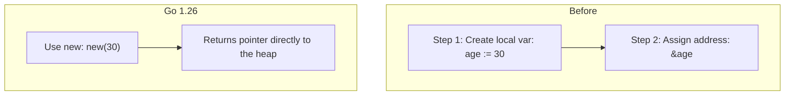
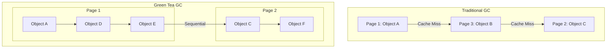

Hey everyone!

Go 1.26 was released in February 2026, six months after version 1.25. The release brings updates to the language specification, runtime behavior, and development toolchain.

The main highlight is the default activation of the Green Tea garbage collector, which focuses on memory locality. Below are the key changes detailed by component.

---

## What you will find here

This version introduces updates in four main areas:

1. **Language changes**: `new` supporting expression operands and self-referencing generic type parameters.
2. **New garbage collector**: Green Tea GC enabled by default.
3. **Tools**: refactoring of the `go fix` command to support modernizers.
4. **Standard library**: optimizations in `io`, new iterators in `reflect`, and new cryptographic packages.

---

## 1. Language Changes

### The `new` function accepts expressions as operands

The built-in `new` function now allows its argument to be an expression, defining the initial value of the allocated pointer.

This change reduces the boilerplate code required to reference pointers in optional struct fields, such as those used in JSON serialization or Protocol Buffers:

```go
type Person struct {
    Name string `json:"name"`
    Age  *int   `json:"age"` // nil if omitted from payload
}

func personJSON(name string, born time.Time) ([]byte, error) {
    return json.Marshal(Person{
        Name: name,
        Age:  new(yearsSince(born)), // Direct allocation and initialization
    })
}
```

Previously, the compiler required declaring a temporary variable to obtain the memory address:

```go
// Pre-Go 1.26 approach
age := yearsSince(born)
person := Person{Name: name, Age: &age}
```



### Generics: self-referencing in type parameter lists

The restriction preventing a generic type from referencing itself in its own type parameter list has been removed. It is now possible to define type constraints that refer to the generic type being constrained:

```go
type Adder[A Adder[A]] interface {
    Add(A) A
}

func algo[A Adder[A]](x, y A) A {
    return x.Add(y)
}
```

Before this release, declaring the `Adder` interface on the first line triggered a compilation error. This change simplifies the generics specification and supports more expressive constraints.

---

## 2. New Garbage Collector: Green Tea GC

### Architecture of the Green Tea GC

The Green Tea garbage collector, previously available under an experimental flag in Go 1.25, is now the default collector.

Unlike the traditional algorithm, which performs scanning based on individual pointers scattered across memory (which can degrade cache locality), the Green Tea GC processes contiguous memory blocks and pages.



This approach enhances spatial locality and reduces marking and sweeping latency for small objects.

### Performance Impact of the GC

The estimated reduction in GC overhead ranges from 10% to 40% in applications with high small-object allocation rates.

On modern CPUs that support vector instructions (such as Intel Ice Lake, AMD Zen 4, or newer), the runtime leverages vectorization to optimize object scanning, yielding an additional performance improvement of approximately 10%.

### Disabling the Collector Temporarily

If you encounter performance regressions or unexpected behavior, the previous collector can be re-enabled using the `GOEXPERIMENT` flag at build time:

```bash
GOEXPERIMENT=nogreenteagc go build .
```

> **Compatibility Notice**: The `nogreenteagc` flag will be removed in Go 1.27. Any issues encountered with the new collector should be reported directly to the official Go issue tracker.

### Runtime Optimizations

* **CGO Invocations**: The baseline runtime overhead for calling C functions via cgo has been reduced by approximately 30%.
* **Heap Address Randomization**: On 64-bit systems, the runtime now randomizes the heap base address at startup to mitigate security risks associated with pointer predictability.
* **Goroutine Leak Profile (Experimental)**: A diagnostic profile designed to detect goroutines permanently blocked on channels, mutexes, or condition variables. It can be run with the following flag:

```bash
GOEXPERIMENT=goroutineleakprofile go build .
```

---

## 3. Tools: Rewritten `go fix`

The `go fix` utility has been restructured and now centralizes the execution of **modernizers**. These are static analysis tools that automate the migration of legacy codebases to modern syntax patterns and newer standard library APIs.

The rewritten tool uses the same analysis engine as `go vet`, enabling issues flagged by linters to be automatically resolved.

```bash
# Apply modernization rules to the project
go fix ./...
```

Modernizers apply refactorings that preserve the program's original semantics. The tool also includes a source-level inliner activated by the `//go:fix inline` directive to help automate internal API deprecation migrations.

### Other Toolchain Updates

* **Default version in `go.mod`**: The `go mod init` command now defaults to the previous minor version of Go (e.g., Go 1.26 initializes the file with the `go 1.25.0` directive), promoting backward compatibility.
* **Removal of `cmd/doc`**: The internal executable `go tool doc` has been deprecated. The standard command `go doc` remains available with the same functionality.
* **Flame Graph defaults**: The web interface of the `pprof` tool (started with the `-http` flag) now displays the Flame Graph as the default view.

---

## 4. Standard Library

### `log/slog`: MultiHandler

The structured logging package now includes the `NewMultiHandler` function, allowing log events to be dispatched to multiple destinations simultaneously without custom adapter implementations:

```go
handler := slog.NewMultiHandler(
    slog.NewJSONHandler(os.Stdout, nil),
    slog.NewTextHandler(logFile, nil),
)
logger := slog.New(handler)
```

### `io`: `io.ReadAll` Optimization

The implementation of `io.ReadAll` has been optimized to allocate smaller intermediate buffers and return slices sized exactly to the data read. The operation is up to twice as fast and reduces memory allocation by approximately 50% for medium to large payloads.

### `reflect`: Iterators for Structs and Types

Aligning with the new support for range-over-functions (functional iterators), the `reflect` package introduces native iterators for fields and method signatures:

```go
// Simplified iteration over struct fields
for field, value := range reflect.ValueOf(myStruct).Fields() {
    fmt.Println(field.Name, value)
}
```

The new methods include `Type.Fields`, `Type.Methods`, `Type.Ins`, `Type.Outs`, `Value.Fields`, and `Value.Methods`.

### `testing`: Artifact Directory

Tests, benchmarks, and fuzzing routines now support a designated directory for output files generated during test execution (such as screenshots, raw JSON data, or custom logs). These are exposed via `T.ArtifactDir()`, `B.ArtifactDir()`, and `F.ArtifactDir()` when passing the `-artifacts` flag:

```bash
go test -artifacts ./...
```

---

## Summary of Key Changes

| Component | Change | Practical Impact |
| :--- | :--- | :--- |
| **Runtime** | Green Tea GC by default | 10% to 40% reduction in garbage collection overhead |
| **Language** | `new` with expressions | Simplified syntax for pointer allocation and initialization |
| **Language** | Self-referential generics | Flexibly defined generic type constraints |
| **Tools** | Modernizers in `go fix` | Automated refactoring to align with modern APIs |
| **Runtime** | CGO performance optimization | Approximately 30% lower overhead for C calls |
| **`io`** | `io.ReadAll` optimization | Up to 2x faster execution with 50% fewer allocations |
| **Platforms** | Deprecation of macOS 12 | Go 1.27 will require macOS 13 Ventura or newer |

---

## Conclusion

Go 1.26 consolidates performance improvements focused on memory efficiency, particularly through the Green Tea GC. The benefits are most noticeable in services with high small-object allocation rates.

Syntax enhancements simplify pointer patterns, and the rebuilt `go fix` command facilitates automated codebase maintenance. The release adheres to the Go 1 compatibility guarantee, ensuring existing code compiles without manual modifications.

---

## Technical References

* [Go 1.26 Release Notes](https://go.dev/doc/go1.26) - Official release documentation.
* [Go Downloads](https://go.dev/dl/) - Official installation binaries for version 1.26.
* [Green Tea GC Design](https://github.com/golang/go/issues/73581) - Technical proposal and discussion on the memory-block-centric collector.
* [Go Modernizers Proposal](https://go.dev/blog/) - Details on the rewritten `go fix` architecture.
* [Avoiding Premature Concurrency in Go](/go-concorrencia-prematura-problemas/) - Insights on concurrency design and resource optimization.
