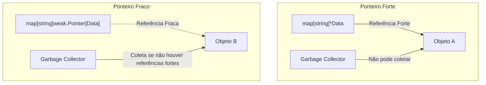

E aí, pessoal!

Gerenciamento de memória em caches na memória sempre foi um desafio em Go. Se você armazena dados em um mapa padrão, como um `map[string]*Resource`, você está retendo referências fortes para esses objetos. Isso significa que eles nunca serão coletados pelo Garbage Collector (GC), mesmo que o restante do sistema já tenha parado de usá-los.

O novo pacote `weak`, adicionado na biblioteca padrão no Go 1.24 e consolidado no Go 1.25 e 1.26, resolve exatamente isso. Ele traz o conceito de **ponteiros fracos** (`weak.Pointer`), permitindo referenciar objetos sem impedir que sejam coletados pelo GC.

Abaixo está o funcionamento detalhado dessa novidade e um exemplo prático de implementação de cache seguro.

---

## O Problema das Referências Fortes

Por padrão, todas as referências a ponteiros em Go são fortes (*strong references*). Se um objeto é alcançável a partir de qualquer variável ativa (como chaves ou valores em um mapa global de cache), o Garbage Collector é obrigado a mantê-lo vivo na memória.



Se o seu cache crescer constantemente e você não implementar políticas agressivas de despejo (como expiração por TTL ou tamanho máximo), a memória da aplicação irá inflar continuamente, podendo resultar em erros de Out Of Memory (OOM).

As abordagens tradicionais com TTL resolvem parcialmente, mas podem remover objetos que ainda estão sendo usados de forma ativa em outras goroutines, forçando requisições redundantes de I/O.

---

## A Solução: `weak.Pointer`

Um ponteiro fraco é uma referência que não impede a coleta do objeto associado pelo Garbage Collector. Se a única referência restante for um ponteiro fraco, o GC o desalocará no próximo ciclo.

O pacote nativo possui uma API muito simples e direta:

1. **`weak.Make(ptr)`**: Cria um `weak.Pointer[T]` a partir de um ponteiro forte convencional `*T`.
2. **`wptr.Value()`**: Retorna o ponteiro forte original `*T`. Se o objeto já tiver sido coletado pelo Garbage Collector, o retorno será `nil`.

---

## Implementando um Cache com Ponteiros Fracos

Abaixo está uma estrutura básica de cache em memória que utiliza `weak.Pointer`. O cache armazena os recursos, mas permite que o GC os libere caso nenhum outro local do programa os esteja retendo de forma forte.

<a href="https://go.dev/play/p/RQgvzWLQTGe" target="_blank" style="text-decoration: none; display: inline-flex; align-items: center; gap: 8px; padding: 8px 18px; background-color: #4b33bb; color: white; border-radius: 8px; font-weight: bold; margin-bottom: 16px; box-shadow: 0 2px 8px rgba(75, 51, 187, 0.35);">
    <svg viewBox="0 0 24 24" width="16" height="16" fill="currentColor"><path d="M8 5v14l11-7z"/></svg>
    Executar Exemplo no Go Playground
</a>

```go
package main

import (
	"runtime"
	"sync"
	"weak"
)

type Resource struct {
	ID   string
	Data []byte
}

type WeakCache struct {
	mu    sync.RWMutex
	items map[string]weak.Pointer[Resource]
}

func NewWeakCache() *WeakCache {
	return &WeakCache{
		items: make(map[string]weak.Pointer[Resource]),
	}
}

// Set adiciona uma referência fraca para o objeto no cache
func (c *WeakCache) Set(key string, val *Resource) {
	c.mu.Lock()
	defer c.mu.Unlock()
	c.items[key] = weak.Make(val)
}

// Get recupera o objeto se ele ainda estiver vivo na memória
func (c *WeakCache) Get(key string) (*Resource, bool) {
	c.mu.RLock()
	defer c.mu.RUnlock()

	wptr, ok := c.items[key]
	if !ok {
		return nil, false
	}

	val := wptr.Value()
	if val == nil {
		// O objeto foi coletado pelo GC
		return nil, false
	}

	return val, true
}
```

---

## Dica Avançada: Limpando Chaves Órfãs com `runtime.AddCleanup`

O exemplo anterior resolve a desalocação do valor, mas a chave (a string no mapa) ainda permanece ocupando espaço na memória de forma indefinida, gerando chaves órfãs vazias.

Para resolver isso, o Go 1.24 introduziu a função nativa `runtime.AddCleanup` (uma alternativa muito mais segura e eficiente ao antigo `runtime.SetFinalizer`). Ela aceita um objeto alvo, uma função callback e um argumento a ser passado para ela quando o objeto alvo se tornar inacessível.

Podemos usá-la para disparar uma limpeza automática da chave correspondente do mapa sempre que o Garbage Collector coletar o valor:

```go
// SetComLimpeza adiciona o valor e registra o callback de limpeza automática
func (c *WeakCache) SetComLimpeza(key string, val *Resource) {
	c.mu.Lock()
	defer c.mu.Unlock()

	c.items[key] = weak.Make(val)

	// Registra o cleanup para remover a chave do mapa quando val for coletado pelo GC
	runtime.AddCleanup(val, func(k string) {
		c.mu.Lock()
		defer c.mu.Unlock()

		// Garante que não estamos apagando uma chave que foi atualizada com outro valor ativo
		if wptr, ok := c.items[k]; ok && wptr.Value() == nil {
			delete(c.items, k)
		}
	}, key)
}
```

Diferente do `SetFinalizer`, o `AddCleanup` é genérico, lida perfeitamente com ponteiros internos e ciclos de referência, e não atrasa a liberação da memória do próprio objeto.

---

## Conclusão

Ponteiros fracos representam uma evolução importante para quem desenvolve serviços de alta performance em Go. A combinação de `weak.Pointer` com `runtime.AddCleanup` viabiliza o desenvolvimento de caches de memória inteligentes que respondem de forma dinâmica à pressão de memória do runtime, sem a necessidade de lógicas complexas de desalocação manual ou TTLs arbitrários.

Recomenda-se utilizar ponteiros fracos apenas quando o ciclo de vida do objeto puder ser delegado com segurança ao coletor padrão do runtime, mantendo testes robustos com `-race` habilitado.

---

## Referências Técnicas

* [Documentação do Pacote weak](https://pkg.go.dev/weak) - Detalhes da API oficial de ponteiros fracos.
* [Discussão de Proposta do weak.Pointer](https://github.com/golang/go/issues/67552) - Discussões técnicas de design e escopo da funcionalidade.
* [runtime.AddCleanup no Go 1.24](https://go.dev/doc/go1.24) - Notas de lançamento detalhando o substituto dos finalizadores clássicos.
* [Evitando Concorrência Prematura em Go](/go-concorrencia-prematura-problemas/) - Boas práticas de concorrência e estrutura de dados seguras.
