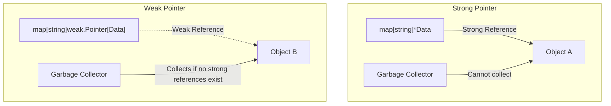

Hey everyone!

Memory management in in-memory caches has always been a challenge in Go. If you store data in a standard map, such as `map[string]*Resource`, you are holding strong references to those objects. This means they will never be garbage collected, even if the rest of the application has stopped using them.

The new `weak` package, introduced in the standard library in Go 1.24 and consolidated in Go 1.25 and 1.26, solves this exact problem. It brings the concept of **weak pointers** (`weak.Pointer`), allowing you to reference objects without preventing them from being reclaimed by the Garbage Collector (GC).

Below is a detailed look at how this feature works and a practical example of implementing a safe cache.

---

## The Problem of Strong References

By default, all pointer references in Go are strong. If an object is reachable from any active variable (such as keys or values in a global cache map), the Garbage Collector is forced to keep it alive in memory.



If your cache grows indefinitely and you do not implement aggressive eviction policies (like TTL-based expiration or maximum size limits), the application's memory usage will continuously inflate, potentially resulting in Out Of Memory (OOM) errors.

Traditional TTL-based approaches partially solve this, but they might evict objects that are still actively used in other goroutines, forcing redundant I/O operations.

---

## The Solution: `weak.Pointer`

A weak pointer is a reference that does not prevent the garbage collector from reclaiming its referenced object. If the only remaining reference to an object is a weak pointer, the GC will deallocate it during the next cycle.

The native package has a very simple and direct API:

1. **`weak.Make(ptr)`**: Creates a `weak.Pointer[T]` from a conventional strong pointer `*T`.
2. **`wptr.Value()`**: Returns the original strong pointer `*T`. If the object has already been collected, it returns `nil`.

---

## Implementing a Cache with Weak Pointers

Below is a basic implementation of an in-memory cache using `weak.Pointer`. The cache stores resources, but allows the GC to free them if no other part of the program is holding a strong reference to them.

<a href="https://go.dev/play/p/RQgvzWLQTGe" target="_blank" style="text-decoration: none; display: inline-flex; align-items: center; gap: 8px; padding: 8px 18px; background-color: #4b33bb; color: white; border-radius: 8px; font-weight: bold; margin-bottom: 16px; box-shadow: 0 2px 8px rgba(75, 51, 187, 0.35);">
    <svg viewBox="0 0 24 24" width="16" height="16" fill="currentColor"><path d="M8 5v14l11-7z"/></svg>
    Run Example on Go Playground
</a>

```go
package main

import (
	"runtime"
	"sync"
	"weak"
)

type Resource struct {
	ID   string
	Data []byte
}

type WeakCache struct {
	mu    sync.RWMutex
	items map[string]weak.Pointer[Resource]
}

func NewWeakCache() *WeakCache {
	return &WeakCache{
		items: make(map[string]weak.Pointer[Resource]),
	}
}

// Set adds a weak reference to the object in the cache
func (c *WeakCache) Set(key string, val *Resource) {
	c.mu.Lock()
	defer c.mu.Unlock()
	c.items[key] = weak.Make(val)
}

// Get retrieves the object if it is still alive in memory
func (c *WeakCache) Get(key string) (*Resource, bool) {
	c.mu.RLock()
	defer c.mu.RUnlock()

	wptr, ok := c.items[key]
	if !ok {
		return nil, false
	}

	val := wptr.Value()
	if val == nil {
		// Object has been reclaimed by the GC
		return nil, false
	}

	return val, true
}
```

---

## Advanced Tip: Cleaning Up Orphaned Keys with `runtime.AddCleanup`

The previous example handles values being deallocated, but the map keys (the string itself) still remain in the map indefinitely, resulting in empty orphaned keys.

To resolve this, Go 1.24 introduced `runtime.AddCleanup` (a much safer and more efficient alternative to the old `runtime.SetFinalizer`). It accepts a target object, a callback function, and an argument to be passed to it when the target object becomes unreachable.

We can use it to trigger an automatic cleanup of the corresponding map key whenever the Garbage Collector reclaims the value:

```go
// SetWithCleanup adds the value and registers the automatic cleanup callback
func (c *WeakCache) SetWithCleanup(key string, val *Resource) {
	c.mu.Lock()
	defer c.mu.Unlock()

	c.items[key] = weak.Make(val)

	// Register the cleanup to remove the key from the map when val is garbage collected
	runtime.AddCleanup(val, func(k string) {
		c.mu.Lock()
		defer c.mu.Unlock()

		// Ensure we don't delete a key that has been updated with another active value
		if wptr, ok := c.items[k]; ok && wptr.Value() == nil {
			delete(c.items, k)
		}
	}, key)
}
```

Unlike `SetFinalizer`, `AddCleanup` is generic, handles interior pointers and reference cycles cleanly, and does not delay freeing the object's memory.

---

## Conclusion

Weak pointers are an important evolution for developing high-performance services in Go. Combining `weak.Pointer` with `runtime.AddCleanup` enables the creation of smart memory caches that dynamically respond to runtime memory pressure without complex manual eviction logic or arbitrary TTLs.

It is recommended to use weak pointers only when the lifecycle of the object can be safely delegated to the runtime's default collector, maintaining robust testing with `-race` enabled.

---

## Technical References

* [weak Package Documentation](https://pkg.go.dev/weak) - Details on the official weak pointers API.
* [weak.Pointer Proposal Discussion](https://github.com/golang/go/issues/67552) - Technical design and scope discussions.
* [runtime.AddCleanup in Go 1.24](https://go.dev/doc/go1.24) - Release notes detailing the new finalizer replacement.
* [Avoiding Premature Concurrency in Go](/go-concorrencia-prematura-problemas/) - Best practices on concurrency and safe data structures.
